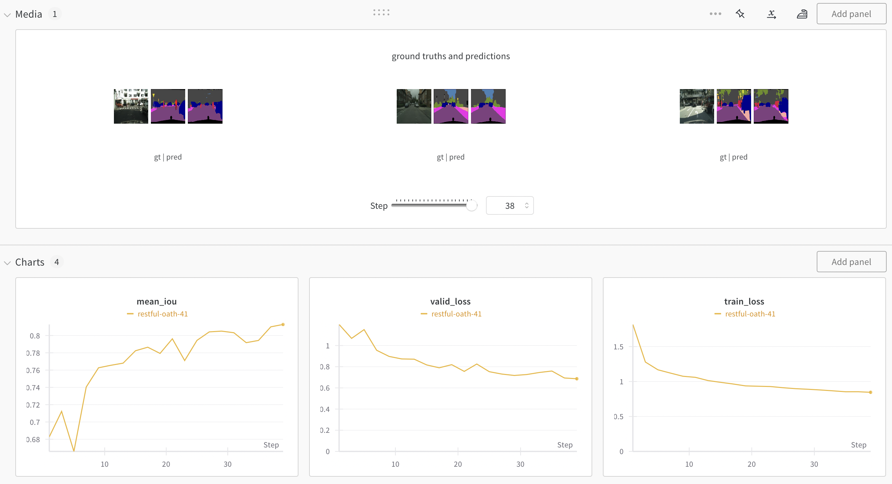

# unet-torch-mps
## Models
- [x] [UNet](https://arxiv.org/abs/1505.04597)
- [x] [ResUNet-a](https://arxiv.org/abs/1904.00592)

## Installation
### Install PyTorch that corresponds with your device.
```bash
$ conda install pytorch torchvision torchaudio pytorch-cuda=12.1 -c pytorch -c nvidia
```
### Install dependencies
if something's missing, please install them with pip.
```bash
$ pip install -r requirements.txt
```

## RUN
```bash
$ cd scripts && bash download.sh
```
Go to ```unet-torch-mps/python``` and run

```bash
$ python train.py --help

usage: train.py [-h] [-d D] [-lr LR] [-e E] [-c C] [-b B] [-ci CI] [-sanity_check] [-ckpt CKPT]

options:
  -h, --help     show this help message and exit
  -d D           dataset directory
  -lr LR         learning rate
  -e E           number of epochs
  -c C           number of classes
  -b B           batch size
  -ci CI         ckpt interval
  -sanity_check  sanity check mode. use validation data for training
  -ckpt CKPT     ckpt path
```

## Sample Result
https://wandb.ai/joon/unet-pytorch




## TODO
- [ ] implement scheduler
- [ ] implement attention unet
- [ ] optimize gpu utilization
- [ ] make docker file
